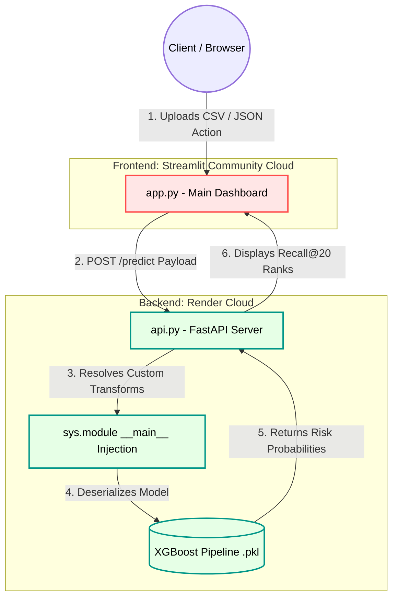

# 📉 Customer Retention Intelligence: End-to-End MLOps Pipeline

[](https://www.python.org/)
[](https://fastapi.tiangolo.com/)
[](https://streamlit.io/)
[](https://xgboost.readthedocs.io/)
[](https://scikit-learn.org/)
[](https://opensource.org/licenses/MIT)

An end-to-end, cloud-deployed Machine Learning pipeline designed for the telecommunications industry. This project transcends standard accuracy metrics by optimizing for strict business constraints—specifically, maximizing ROI on retention budgets using a **Recall@20%** ranking strategy.

It features a decoupled architecture with a FastAPI prediction engine, an interactive Streamlit frontend, a bulletproof two-phase Scikit-Learn preprocessing pipeline, and a live Concept Drift simulator.

### 🔗 Live Deployments
* **Frontend UI (Streamlit):** https://priyanshu-retention-intelligence.streamlit.app/
* **Backend API (FastAPI/Render):** https://api-service-for-xgb-pipeline.onrender.com
* **Interactive API Documentation (Swagger UI):** https://api-service-for-xgb-pipeline.onrender.com/docs

---

## 🏗 System Architecture & Tech Stack

This project is built on a decoupled, cloud-ready architecture to ensure distinct separation of concerns between the user interface and the inference engine.



* **The Brain (Backend):** A FastAPI server hosting a serialized, two-phase XGBoost pipeline. It automatically generates interactive Swagger documentation at `/docs` for seamless third-party testing.
* **The Face (Frontend):** A modular Streamlit dashboard that orchestrates JSON payloads to the API for real-time and batch predictions.
* **Core Stack:** `scikit-learn`, `xgboost`, `pandas`, `fastapi`, `streamlit`, `plotly`.

---

## 📊 The Business Logic: Why Recall@20?

A high-classification metric (like F1 or overall Recall) is meaningless if it doesn't align with business reality. Standard 0.5-threshold optimization assumes an unlimited budget to contact every single customer flagged as a risk, leading to expensive false positives.

**The "Gift Basket" Constraint:**
> Imagine a database of 100 customers. Secretly, 25 are planning to cancel next week. Marketing has a strict budget to send VIP retention gift baskets to exactly 20 people (a 20% resource constraint). If we hand them out randomly, we waste money. 
> 
> Instead, our model ranks customers by raw churn probability. We target the top 20. Out of those 20 baskets, 13 go to the secret group of 25 actual churners. Our **Recall@20 is 52% (13/25)**. 
>
> **Conclusion:** By leveraging probabilistic ranking, we can intercept more than half of the total revenue about to walk out the door while utilizing only 1/5th of the budget.

---

## 🧠 Machine Learning Philosophy & Model Selection

### 1. The Two-Phase Pipeline Architecture
Messy DataFrame manipulation invalidates model comparison and prevents production scaling. To solve "Array Stripping" and "Prefix Leaks", all preprocessing is locked inside a strict Sklearn pipeline:
* **Phase 1 (Sequential Cleaning):** Custom `FunctionTransformers` execute sequentially to engineer behavioral features (e.g., combining Partner and Dependents into a "Stability" metric) and fill nulls before mathematical scaling.
* **Phase 2 (Parallel Master Transformer):** Scaling (`StandardScaler`) and encoding (`OneHotEncoder`) run in parallel via a `ColumnTransformer` with `verbose_feature_names_out=False` to preserve downstream namespace integrity.

### 2. The SMOTE Trap
While synthetic oversampling (SMOTE) improved standard overall Recall, experimentation proved it injected calibration noise into the highest probability bounds, effectively *dropping* our critical Recall@20% metric. We opted for native algorithm weights (`class_weight='balanced'`) for cleaner probability ranking.

### 3. Model Showdown: XGBoost vs. Random Forest
* **Random Forest:** ROC-AUC: 0.8473 | Overall Recall: 83.5% | Recall@20: 51.4%
* **XGBoost:** ROC-AUC: 0.8487 | Overall Recall: 85.0% | Recall@20: 50.3%
* **The Decision:** XGBoost was crowned the champion. The 1.1% difference in Recall@20 was a statistical tie (less than 4 customers). XGBoost provided a wider safety net (85% overall recall) and better global calibration (ROC-AUC), meaning it scales safer if the business budget suddenly increases to 30% or 40%.

---

## 🖥 User Interface (Streamlit)

The UI is divided into 5 distinct operational modules:

1. **High-Level Dashboard:** Project introduction and system status.
2. **Business Strategy Studio:** Real-time Single and Batch CSV inference strictly focused on isolating the Top 20% highest flight-risk accounts. 
3. **Model Mechanics:** Standard threshold classification insights, detailing our 2-phase pipeline engineering and the decision to forgo SMOTE.
4. **Data Insights (EDA):** Interactive Plotly visualizations highlighting anomalies: The Electronic Check Anomaly, Month-to-Month Senior Citizens, and the Zero-Tenure Data Trap.
5. **Concept Drift Matrix (Live Simulator):** An interactive module that injects mathematical drift into a live data stream (`stream_data.csv`), triggering an SLA failure, and successfully executing a shadow deployment to retrain a Challenger model using base data.

---

## 🛠 Engineering Hurdles Conquered

* **The Namespace Trap:** Pickling custom Scikit-Learn `FunctionTransformers` (`preprocessing_raw_data`, `binaryEncoder`) causes unpickling errors in decoupled environments. **Solution:** Dynamically injected these functions into the `__main__` namespace via Python's `sys` module in `api.py` to allow the FastAPI server to successfully deserialize the model.
* **Environment Drift:** Streamlit Cloud defaulted to `scikit-learn 1.8.0` causing `InconsistentVersionWarning` crashes against our `1.7.2` model. **Solution:** Enforced strict dependency pinning in `requirements.txt`.
* **State Management & Memory:** Unrestricted model loading caused out-of-memory errors on EDA pages. **Solution:** Isolated the `production_pipeline.pkl` loading state strictly to the Streamlit pages that require active inference.

---

## 💻 Local Installation

1. **Clone the repository:**
   ```bash
   git clone [https://github.com/yourusername/end-to-end-churn-ml.git](https://github.com/yourusername/end-to-end-churn-ml.git)
   cd end-to-end-churn-ml
   ```

2. **Create a virtual environment:**
   ```bash
   python -m venv venv
   source venv/bin/activate  # On Windows: venv\Scripts\activate
   ```

3. **Install exact dependencies:**
   ```bash
   pip install -r requirements.txt
   ```

4. **Launch the FastAPI Backend:**
   ```bash
   uvicorn api:app --reload --port 8000
   ```

5. **Launch the Streamlit Frontend (In a new terminal):**
   ```bash
   streamlit run app.py
   ```

---

## 👨‍💻 Author
**Priyanshu Upadhyay**
* [LinkedIn](Insert LinkedIn Link)
* [Portfolio](Insert Portfolio Link)

*Designed with a focus on scalable MLOps, rigorous software engineering, and quantifiable business value.*
```
